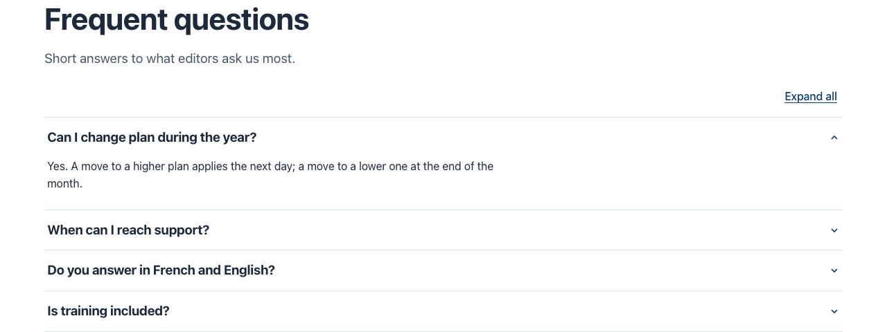

# Accordion

Types: `ctpl:accordion` (Accordion), `ctpl:accordionItem` (Accordion entry)

## What it is

A section of entries that visitors open and close: each entry is a heading (for example a question) and the text it reveals (the answer). Use it for questions and answers, or for details that only some visitors need.

## Where you can add it

- The page's **main area**.
- Inside a [Columns](columns.md) column, a [Free zone](free-zone.md) or a [Tabs](tabs.md) tab.

Entries are added inside the accordion. Reorder them in Page Builder or jContent.

## Fields

### Accordion

| Label as shown in the editor | What it does                                          | Notes                                    |
| ---------------------------- | ----------------------------------------------------- | ---------------------------------------- |
| Title                        | The section heading.                                  | Per language. Optional. Level 2 heading. |
| Lead text                    | A sentence or two under the title, above the entries. | Per language. Optional.                  |
| Background                   | Page background, Light band or Accent tint.           | See [Section style](section-style.md).   |
| Call to action               | Optional toggle. Adds a button after the entries.     | See [Call to action](call-to-action.md). |

### Accordion entry

| Label as shown in the editor | What it does                                                    | Notes                                           |
| ---------------------------- | --------------------------------------------------------------- | ----------------------------------------------- |
| Title                        | The heading visitors click, for example a question.             | Per language. An entry without it is not shown. |
| Text                         | The text revealed when the entry opens, for example the answer. | Per language. Rich text.                        |
| Open when the page loads     | Shows the entry open when the page loads.                       | Default: closed.                                |

## How it behaves

### Opening and closing

- Visitors open and close an entry by clicking or tapping its heading, or with the keyboard: Tab to the heading, then Enter or Space. This works even without JavaScript.
- With JavaScript, an **Expand all** button above the entries opens every entry at once. Once they are all open it reads **Collapse all**. The button follows the entries visitors open and close themselves. Without JavaScript the button is not shown.

### Links to an entry

Every entry has an anchor built from its name in jContent, for example `#acc-change-plan` for an entry named `change-plan`. A link to `page.html#acc-change-plan` opens that entry and scrolls to it, also from another part of the same page. To find the anchor, look at the entry's system name in jContent.

### Headings

- Entry headings are one level below the accordion title: level 3 under a titled accordion, level 2 when the accordion has no title (one more level down inside a titled columns row or a tab).
- Headings written in an entry's text are renumbered under the entry's heading. See [Rich text](rich-text.md#headings-are-renumbered).
- Tables in an entry's text scroll sideways on small screens. See [Rich text](rich-text.md#tables-scroll-on-small-screens).

### Edit mode

In Page Builder every entry is shown open, as a heading followed by its text, so you can select and edit each one. The "add" button under the entries adds a new entry.

### Empty accordion

An accordion with no entry (or none with a heading in the current language) shows nothing on the live site. It stays in edit mode so you can add entries.

## Good practice

- Write entry headings that say what is inside ("Can I change plan during the year?"): visitors skim the headings to find their question.
- Keep answers short. A long answer is easier to read on a page of its own.
- Open at most one entry by default, the one most visitors need.
- Do not hide information that every visitor must read (prices, legal conditions) in a closed entry.

## In other languages

The accordion title, lead text, entry headings and texts are per language. An entry without a heading in a language is left out of that language's page; edit mode shows "This entry has no heading in this language: it is not shown." The "Open when the page loads" setting is shared by every language.
