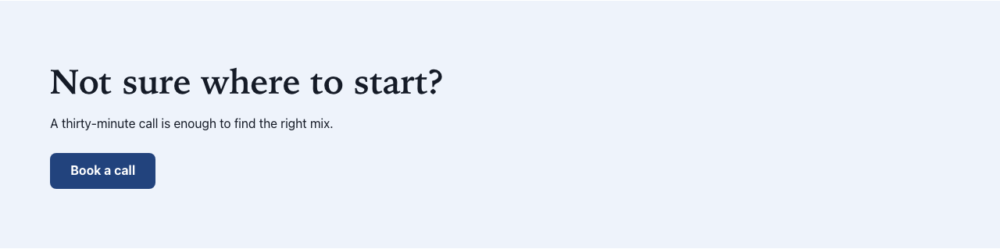

# Call to action

Type: `ctplmix:cta` (a shared field group, not a component on its own)

## What it is

A call to action is one button: a link and the text written on it. It is not a component you drop on a page. It is a group of two fields, **Button label** and **Link**, that several components share. Some components have it built in and place the button in their own layout. Every other section can switch it on with the **Call to action** toggle in its edit form.

## Where you can add it

| Component                                                                                                                                                                    | How the call to action appears                                                                           |
| ---------------------------------------------------------------------------------------------------------------------------------------------------------------------------- | -------------------------------------------------------------------------------------------------------- |
| [Hero banner](hero-banner.md)                                                                                                                                                | Built in. The button sits under the subtitle. Over a photo it uses a light style.                        |
| [Image and text](image-and-text.md)                                                                                                                                          | Built in. The button sits under the text.                                                                |
| [Content list](content-list.md)                                                                                                                                              | Built in. It is the "see all" link, shown as an outlined button after the list.                          |
| [Text](rich-text.md), [Columns](columns.md), [Card grid](card-grid.md), [Key figures](key-figures.md), [Quote](quote.md), [Site map](site-map.md), [Free zone](free-zone.md) | Optional. Switch on **Call to action** in the edit form. The button appears after the section's content. |

Components that have the call to action built in do not show a second **Call to action** toggle. A [Link list](links-and-link-lists.md) has no call to action: its links are the content.

A component that needs several actions (for example the header utility links) uses a link list instead.

## Fields

| Label as shown in the editor | What it does                                                                  | Notes                                                                                                  |
| ---------------------------- | ----------------------------------------------------------------------------- | ------------------------------------------------------------------------------------------------------ |
| Button label                 | Text of the button, for example "Read more".                                  | Per language. Keep it short and explicit: screen readers read it on its own.                           |
| Link                         | Where the button goes: **No link**, **Page of this site** or **Web address**. | Default: No link. The target is set per language. See [Links and link lists](links-and-link-lists.md). |

## How it behaves

- **Visitors** see a button only when the current language has both a link target and a text for the button.
- **No button label:** when the link points to a page of this site, the button shows that page's title. A web address with no label and no link title shows no button, and edit mode shows the hint "Button label missing".
- **Missing link in this language:** link targets are stored per language. A link you set in English has no target in French until you set it there too. Visitors then see no button at all (never a dead button). In edit mode the button is replaced by the hint "No link target in this language".
- **Refused web address:** an address that does not start with `http://`, `https://`, `mailto:` or `tel:` is not used. It counts as a missing target and shows the same hint.
- **Label without a link:** if you write a button label but leave **Link** on **No link**, visitors see nothing and edit mode shows the hint "This button has a label but no link: choose a page or a web address, or clear the label."
- A section that does not have the call to action switched on shows nothing, in edit mode too.

### Making a call-to-action banner

There is no separate "banner" component. To build one:

1. Add a [Text](rich-text.md) section to the page.
2. Give it a **Title** (the banner's heading) and a short **Text**.
3. Set **Background** to **Accent tint** (see [Section style](section-style.md)).
4. Switch on **Call to action**, write the **Button label** and pick the **Link**.

The result is the banner shown above.

## Good practice

- Write labels that say where the button leads or what it does: "Book a call", "See all news". Avoid "Click here" or "More": a screen reader user who lists the links of a page hears the label without its context.
- Use one call to action per section. If a section needs several links, use a link list.
- Link to pages of this site with **Page of this site**, not by pasting their address as a web address. A page link follows renamed pages, vanity URLs and the visitor's language. A pasted address breaks when the page moves.
- After switching a page to another language, check each button: set the link target and the label in that language too.

## In other languages

Both fields are per language. For each language of the site, fill in the **Button label** and set the **Link** target. The edit-mode hint "No link target in this language" tells you which buttons still need a target.
