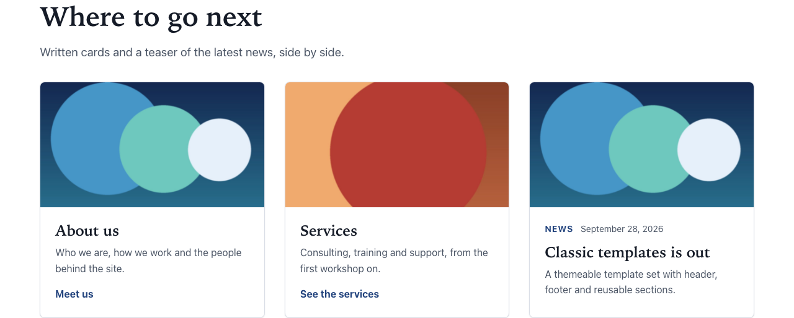

# Card grid

Types: `ctpl:cardGrid` (Card grid), `ctpl:card` (Card), `ctpl:contentTeaser` (Card of an existing item)

## What it is

A section of hand-picked cards in a grid, with an optional title and lead text. You can mix two kinds of cards in any order:

- **Card:** a card you write yourself, with a title, a short text, an image and a link.
- **Card of an existing item:** a card that shows an existing news item or article, with its own title, image and teaser. It changes when the item is edited.

The same cards can be drawn three ways, with the grid's **Display** field:

- **Cards** (default): image, title, text and link text, in 2 to 4 columns.
- **Icon tiles:** outlined square tiles with the card image as a small icon, the title and the text. The whole tile is the link. Good for a set of short entry points ("Write to us", "Service status").
- **Logo strip:** the card images only, in a row that wraps, each optionally linked. Good for partners or certifications.

To list news or articles automatically (the latest six, for example), use a [Content list](content-list.md) instead.

## Where you can add it

- The page's **main area**.
- Inside a [Columns](columns.md) column, or a [Free zone](free-zone.md).

Cards are added inside the card grid. Reorder them in Page Builder or jContent.

## Fields

### Card grid

| Label as shown in the editor | What it does                                                           | Notes                                    |
| ---------------------------- | ---------------------------------------------------------------------- | ---------------------------------------- |
| Title                        | The section heading.                                                   | Per language. Optional. Level 2 heading. |
| Lead text                    | A sentence or two under the title, above the cards.                    | Per language. Optional.                  |
| Display                      | **Cards**, **Icon tiles** or **Logo strip** (see above).               | Default: Cards.                          |
| Cards per row                | **2 cards**, **3 cards** or **4 cards** side by side on large screens. | Default: 3 cards. Cards display only.    |
| Background                   | Page background, Light band or Accent tint.                            | See [Section style](section-style.md).   |
| Call to action               | Optional toggle. Adds a button after the cards.                        | See [Call to action](call-to-action.md). |

### Card

| Label as shown in the editor       | What it does                                                                  | Notes                                                                                    |
| ---------------------------------- | ----------------------------------------------------------------------------- | ---------------------------------------------------------------------------------------- |
| Title                              | The card's heading.                                                           | Per language. For a link to a page of this site, leave it empty to use the page's title. |
| Text                               | One or two sentences under the title.                                         | Per language.                                                                            |
| Link text                          | Optional text at the bottom of the card, for example "Discover our services". | Per language. The whole card is clickable either way. Empty: no link text.               |
| Image                              | The card's image.                                                             | Always decorative (see below).                                                           |
| Text alternative, Decorative image | Image fields shared with other components.                                    | Ignored on cards.                                                                        |
| Link                               | Where the card goes: No link, Page of this site or Web address.               | Per language target. See [Links and link lists](links-and-link-lists.md).                |

### Card of an existing item

| Label as shown in the editor | What it does                                | Notes                                       |
| ---------------------------- | ------------------------------------------- | ------------------------------------------- |
| Item to show                 | The news item or article to show as a card. | Only news items and articles can be picked. |

## How it behaves

### Layout

Cards have equal heights in each row. Phones show one card per row, then two on medium screens, then the number you chose on large screens.

### Written cards

- With a link, the **whole card** is clickable: the title is the link, stretched over the card.
- **Link text** is a visual cue only. Screen readers read the title followed by the link text as one link, so voice control users can also say the visible link text.
- Without a title, a card linking to a page of this site shows that page's title. With no title at all, edit mode shows the hint "This card has no title in this language: it shows no heading.", and the link text is not shown.
- With no link target in the current language, the card shows without a link. Edit mode shows "No link target in this language".
- A card with no title, no text and no image (and no page title borrowed from its link) shows nothing on the live site.

### Icon tiles

- Each tile shows the card image as a small icon (always decorative), the title and the text. Use small, square, simple pictures: a pictogram on a plain disc reads well in light and dark mode.
- With a link, the **whole tile** is clickable; its name is the title. The card's **Link text** is not shown in a tile.
- Tiles fill the row with as many as fit: two side by side on a phone, up to six on a large screen. **Cards per row** does not apply. A tile stays square unless its text needs more room.
- A **Card of an existing item** shows as a tile with the item's title and teaser.

### Logo strip

- Only the card images show, each on a light plate (logos are usually drawn for light backgrounds, so the plate stays light in dark mode), in a row that wraps. **Cards per row** does not apply.
- The logo's text alternative is the card's **Text alternative**, else the card **Title**, else the image title in the media library. Name each logo after the organisation.
- A logo with a link is the link: its text alternative names it. A logo without a link marked **Decorative image** is skipped by screen readers; a linked logo never is (a link needs a name).
- A card without an image, and every **Card of an existing item**, is left out of the strip. Edit mode says so.

### Cards of an existing item

- The card is drawn by the item itself: image, type ("News" or "Article"), date, title linking to the item's page, and teaser. When the item changes, the card changes.
- If no item is picked, or the item is deleted, not published yet, or has no title in the current language, visitors see nothing in its place and edit mode shows "Pick a news item or article to show in this card."

### Images and headings

- Card images are always **decorative**: the title says what the card is about, so screen readers skip the image.
- Card titles are one level below the section title: level 3 under a titled grid, level 2 when the grid has no title (one more level down inside a titled columns row).

### Empty grid

A grid with no visible card (for a logo strip: no card with an image) shows nothing on the live site. It stays in edit mode so you can add cards.

## Good practice

- Keep cards comparable: similar length titles and texts, all with an image or none.
- Keep the text to one or two sentences. Long texts make uneven, hard-to-scan cards.
- Write distinct card titles: they are the names of the links. Several cards called "Learn more" would all sound the same to a screen reader user.
- Use **Link text** for a visible cue ("See the services"), not to repeat the title.
- Give the grid a title when it introduces a set ("Our offers"): the card titles then become sub-headings of it.

## In other languages

Every text of the grid and of written cards is per language, and so is the card link target. The picked item of a **Card of an existing item** is shared, but the card shows the item in the visitor's language, and nothing in a language the item has no title in.
