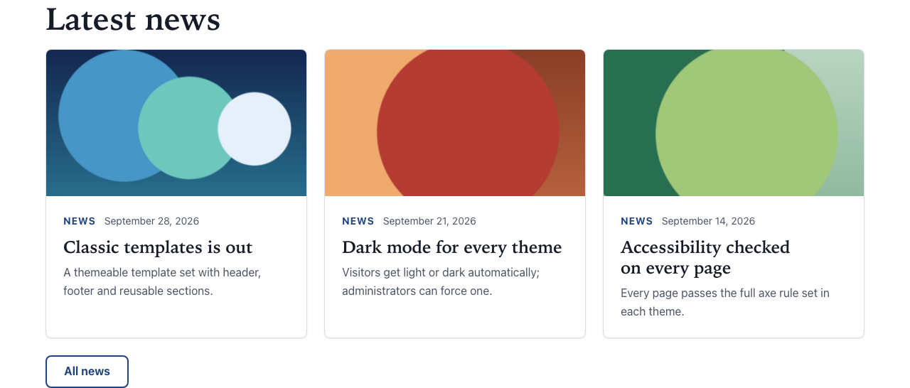

# Content list

Type: `ctpl:jcrQuery`

## What it is

A section that lists news items or articles automatically, with an optional title and a "see all" button. You set what to list, where to look, in what order and how many. New items appear in the list as soon as they are published: you never update the list by hand.

To pick the items yourself, one by one, use a [Card grid](card-grid.md) with **Card of an existing item** cards instead.

## Where you can add it

- The page's **main area**.
- Inside a [Columns](columns.md) column, or a [Free zone](free-zone.md).

## Fields

| Label as shown in the editor | What it does                                                                                                                       | Notes                                                                               |
| ---------------------------- | ---------------------------------------------------------------------------------------------------------------------------------- | ----------------------------------------------------------------------------------- |
| Title                        | The section heading.                                                                                                               | Per language. Optional. Level 2 heading.                                            |
| Content to list              | Type of content the list shows: news items, articles, or both.                                                                     | Default: News item.                                                                 |
| Look under                   | Folder or page under which to look for content.                                                                                    | Optional. Empty: the whole site. You can pick any folder, page or content.          |
| Sort by                      | **Publication date**, **Creation date**, **Last modification date** or **Title**.                                                  | Default: Publication date.                                                          |
| Sort direction               | **Descending** shows the newest items (or titles from Z to A) first. **Ascending** shows the oldest (or titles from A to Z) first. | Default: Descending.                                                                |
| Number of items              | Maximum number of items shown.                                                                                                     | Default: 6. From 1 to 50.                                                           |
| Display                      | **Cards**: a grid of cards with image and teaser. **Compact list**: one row per item with its title and date.                      | Default: Cards.                                                                     |
| Items to leave out           | Items never shown in this list, for example the one already featured above it.                                                     | Optional. Only news items and articles can be picked.                               |
| Categories                   | Only list items in one of these categories, or in one of their subcategories.                                                      | Optional. Empty: every category.                                                    |
| Text when empty              | Text shown when there is nothing to list.                                                                                          | Per language. Optional. Empty: the section is hidden when there is nothing to list. |
| Button label                 | Text of the "see all" button, for example "All news".                                                                              | Per language. See [Call to action](call-to-action.md).                              |
| Link                         | Where the "see all" button goes, usually the page that lists everything.                                                           | Per language target.                                                                |
| Background                   | Page background, Light band or Accent tint.                                                                                        | See [Section style](section-style.md).                                              |

## How it behaves

### What visitors see

- **Cards:** each item shows as a card with its image, its type ("News" or "Article"), its date, its title linking to the item's page, and its teaser. Articles also show their author and reading time.
- **Compact list:** each item shows as one row with its title (a link) and the same line of type, date, author and reading time.
- The **"see all" button** comes after the list, as an outlined button.
- Item titles are one level below the list title: level 3 under a titled list, level 2 when the list has no title (one more level down inside a titled columns row).
- The list is refreshed when an item under **Look under** is added, changed or published.

### Which items are shown

1. Items of the chosen type under **Look under** (or anywhere in the site).
2. If you picked **Categories**: only items filed in one of them or in one of their subcategories. These are the categories set on each item with Jahia's categories, not its tags.
3. Sorted as you asked.
4. **Items to leave out** are skipped.
5. **Items not translated into the page's language are skipped.** A French page never shows an English-only item with an empty title.
6. The list keeps the first items that remain, up to **Number of items**. Skipped items do not make the list shorter as long as there are enough others.

Sorting by **Publication date** uses the publication date stored in each item. An item whose publication date is empty shows its creation date to visitors, but it is not sorted by that creation date. Fill in the publication date of every item when you sort on it.

### When there is nothing to list

- With **Text when empty**: visitors see the title, your text and the button.
- Without it: the whole section is hidden on the live site.
- In edit mode the section always shows. With nothing to list it says your text, or "Nothing to show yet."

### Start folder deleted or not published

If **Look under** points to a folder or page that was deleted, or is not published yet, the list shows **nothing** on the live site. It never falls back to listing the whole site. In edit mode it shows the warning "The start folder is set but cannot be found here (deleted, or not published yet): the list shows nothing on the live site."

### The edit-mode panel

In edit mode, a panel above the items explains what the list does and found. Visitors never see it.

The first line sums up the settings, for example: "Lists News item under contents/news, newest first, up to 3." It says "newest first" or "oldest first" for dates, and "A to Z" or "Z to A" when the list is sorted by title.

Then one line per setting:

| Line           | What it tells you                                                                                                                                                              |
| -------------- | ------------------------------------------------------------------------------------------------------------------------------------------------------------------------------ |
| Content        | The type of content listed.                                                                                                                                                    |
| Under          | Where the list looks: the site's name for the whole site, else the folder or page path.                                                                                        |
| Sort           | The sort field and direction.                                                                                                                                                  |
| Maximum        | The number of items asked for.                                                                                                                                                 |
| Display        | "cards" or "compact list".                                                                                                                                                     |
| Categories     | "all categories", or the selected categories followed by how many categories they cover with their subcategories, for example "(4 categories with subcategories)".             |
| Excluded       | "none", or the titles of the items left out on purpose.                                                                                                                        |
| Found          | How many items are shown out of how many match, for example "3 shown of 6 matching". A "+" after the number means there are more than the panel counted (it counts up to 500). |
| Left out       | How many matching items were skipped: "1 excluded, 2 not translated into fr".                                                                                                  |
| JCR-SQL2 query | A collapsed line with the technical query, for developers.                                                                                                                     |

If the chosen type cannot be listed, the panel shows "This content type cannot be listed."

Use the panel to understand a list that shows fewer items than you expect: the **Left out** line usually says why (items not translated, or excluded).

## Good practice

- Always point **Look under** at the folder that holds the items (for news, the **News** folder under **contents**). The list then only shows what you expect, even when other content of the same type is added elsewhere.
- Set **Number of items** to what the page needs (3 or 6 on a home page) and add a "see all" button to the page that lists everything.
- Write a **Text when empty** on pages where an empty section would look broken, for example "No news yet: come back soon." Leave it empty on a home page, where hiding the section is better.
- Use **Items to leave out** to avoid showing the same item twice on a page, for example the item already featured in a banner above.
- Give the list a title ("Latest news") so the card titles become sub-headings of it.

## In other languages

- Title, text when empty, button label and link target are per language. The other settings are shared.
- Each language lists only the items translated into it. After translating the list page, translate the items too, or the list will be shorter (or empty) in that language. The **Left out** line of the panel counts them.
