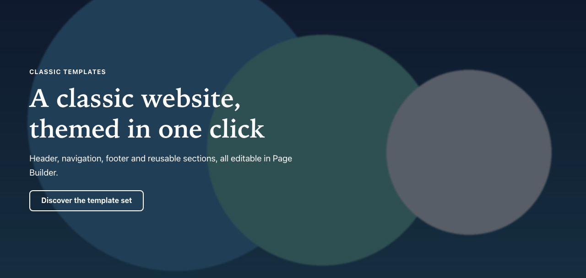

# Hero banner

Type: `ctpl:heroBanner`

## What it is

A large banner with a heading, a short text, an optional photo and a button. It usually opens a page, but you can also place it between two sections to break up a long page.

## Where you can add it

- The **hero area** at the top of a page. It exists on pages that use the **Home** and **Content page** templates. The **Full-width page** template has no hero area.
- The page's **main area**, between other sections.
- Inside a [Columns](columns.md) column, or a [Free zone](free-zone.md).
- Inside a [Hero carousel](hero-carousel.md), as one of its slides.

## Fields

| Label as shown in the editor | What it does                                                                     | Notes                                                         |
| ---------------------------- | -------------------------------------------------------------------------------- | ------------------------------------------------------------- |
| Title                        | The banner's heading.                                                            | Per language. Shown as a level 2 heading (see Good practice). |
| Eyebrow                      | Short line above the heading, for example a category or a date.                  | Per language. Optional. Keep it to a few words.               |
| Subtitle                     | One or two sentences under the heading.                                          | Per language. Optional.                                       |
| Layout                       | **Text over the photo**, **Text beside the photo** or **Tinted band, no photo**. | Default: Text over the photo.                                 |
| Photo darkening              | How much the photo is darkened behind the text: **Medium** or **Strong**.        | Default: Medium. Only used with Text over the photo.          |
| Height                       | How tall the banner is on large screens: **Compact**, **Medium** or **Tall**.    | Default: Medium. On phones the banner grows with its text.    |
| Image                        | The photo.                                                                       | See [Images](images.md).                                      |
| Text alternative             | What the photo means on this page.                                               | Per language. See [Images](images.md).                        |
| Decorative image             | Tells screen readers to skip the photo.                                          | Default: off.                                                 |
| Button label                 | Text of the button.                                                              | Per language. See [Call to action](call-to-action.md).        |
| Link                         | Where the button goes.                                                           | Per language target. See [Call to action](call-to-action.md). |

## How it behaves

### Layouts

- **Text over the photo:** the photo fills the banner and the text sits on top of it, over a dark layer that keeps the text readable. **Photo darkening** sets how dark that layer is. The button uses a light style so it stands out on the photo.
- **Text beside the photo:** the text on the left, the photo on the right, on a light grey band. On small screens the photo and text stack.
- **Tinted band, no photo:** the text on a band tinted with the theme's accent colour.

Whatever layout you pick, a banner **without a photo** always shows as a tinted band.

### What visitors see

- Only the fields you fill in are shown: no eyebrow, no subtitle or no button leaves no empty space.
- In the hero area at the top of a page, the photo loads first so the page appears quickly.
- The button follows the [call to action](call-to-action.md) rules. With no link target in the current language, no button shows; edit mode shows the hint "No link target in this language".

## Good practice

- **One level 1 heading per page.** The page's own title is the page's only level 1 heading. The banner heading is level 2. If the banner already says what the page is about, open the page's **Page options** and tick **Hide the page title**: the title then disappears from the screen but stays for screen readers and search engines. The home page is set up this way.
- Choose **Strong** darkening for bright or busy photos. The text must stay easy to read over every part of the photo.
- With **Text over the photo**, the photo is usually a backdrop: tick **Decorative image** unless the photo carries information the text does not.
- Keep the heading short (a few words) and the subtitle to one or two sentences. On phones long text makes the banner very tall.
- Use at most one banner in the hero area.

## In other languages

Title, eyebrow, subtitle, text alternative, button label and link target are all per language. The layout, darkening, height and photo are shared. Check the button in each language: it only shows where a link target is set.
