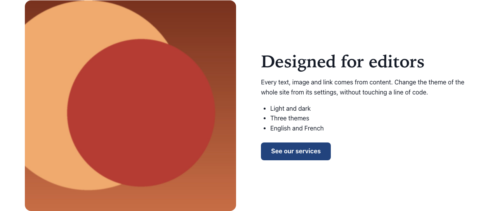

# Image and text

Type: `ctpl:imageText`

## What it is

A section with an image beside a heading, a formatted text and an optional button. Use it to present a service, a team or a topic with a picture.

## Where you can add it

- The page's **main area**.
- Inside a [Columns](columns.md) column, or a [Free zone](free-zone.md).

## Fields

| Label as shown in the editor | What it does                                                              | Notes                                                                          |
| ---------------------------- | ------------------------------------------------------------------------- | ------------------------------------------------------------------------------ |
| Title                        | The section heading.                                                      | Per language. Optional. Level 2 heading (level 3 inside a titled columns row). |
| Text                         | Formatted text shown beside the image.                                    | Per language. Rich text: see [Text](rich-text.md) for what is kept.            |
| Image position               | **Left** or **Right**: side where the image is shown.                     | Default: Left. On phones the image is always above the text.                   |
| Image shape                  | **Landscape**, **Square** or **Portrait**: shape the image is cropped to. | Default: Landscape. The centre of the image is kept.                           |
| Image                        | The picture.                                                              | See [Images](images.md).                                                       |
| Text alternative             | What the picture means in this section.                                   | Per language.                                                                  |
| Decorative image             | Tells screen readers to skip the picture.                                 | Default: off.                                                                  |
| Button label                 | Text of the button.                                                       | Per language. See [Call to action](call-to-action.md).                         |
| Link                         | Where the button goes.                                                    | Per language target.                                                           |
| Background                   | Page background, Light band or Accent tint.                               | See [Section style](section-style.md).                                         |

## How it behaves

- On large screens the image and the text sit side by side. On phones the image comes first, above the heading.
- The image is cropped to the chosen shape, keeping its centre. Pick an image whose subject is in the middle.
- **No image:** visitors see the text alone. In edit mode an empty frame shows "No image selected".
- **Headings in the text** are renumbered to sit under the section title: with a title, the first headings of the text become level 3. See [Text](rich-text.md).
- The button follows the [call to action](call-to-action.md) rules: no link target in the current language means no button, and the hint "No link target in this language" in edit mode.

## Good practice

- Keep the text short enough to sit beside the image: a few paragraphs at most. For long content, use a [Text](rich-text.md) section.
- Alternate **Image position** between consecutive image and text sections (left, then right) for an easier read.
- Write a text alternative that says what the image adds to the section. If it only illustrates, tick **Decorative image**.
- Inside the text, use headings of level 3 and below when the section has a title.

## In other languages

Title, text, text alternative, button label and link target are per language. The image, its position and shape, and the background are shared.
