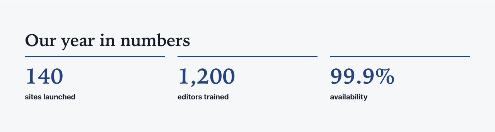

# Key figures

Types: `ctpl:keyFigures` (Key figures), `ctpl:keyFigure` (Key figure)

## What it is

A section of key figures in a row, such as "98%" of "satisfied customers" or "24/7" "support". It has an optional title and lead text. Each figure is a **Key figure** item inside the section.

## Where you can add it

- The page's **main area**.
- Inside a [Columns](columns.md) column, or a [Free zone](free-zone.md).

Key figures are added inside the Key figures section. Reorder them in Page Builder or jContent.

## Fields

### Key figures

| Label as shown in the editor | What it does                                          | Notes                                    |
| ---------------------------- | ----------------------------------------------------- | ---------------------------------------- |
| Title                        | The section heading.                                  | Per language. Optional. Level 2 heading. |
| Lead text                    | A sentence or two under the title, above the figures. | Per language. Optional.                  |
| Background                   | Page background, Light band or Accent tint.           | See [Section style](section-style.md).   |
| Call to action               | Optional toggle. Adds a button after the figures.     | See [Call to action](call-to-action.md). |

### Key figure

| Label as shown in the editor | What it does                                                             | Notes                                                                              |
| ---------------------------- | ------------------------------------------------------------------------ | ---------------------------------------------------------------------------------- |
| Figure                       | The figure exactly as visitors read it: "98%", "12 000", "24/7".         | Per language. Text, not a number: write it the way it is written in this language. |
| Label                        | What the figure counts, for example "satisfied customers".               | Per language.                                                                      |
| Detail                       | Optional short line under the label, for example the source or the year. | Per language.                                                                      |

## How it behaves

- Figures sit in a row: as many as fit, up to four per row, wrapping to fewer on smaller screens.
- Each figure is shown large, with its label right after it and the detail underneath.
- Screen readers read the figure and its label together, as one phrase: "98% satisfied customers".
- **A figure with no value in the current language is left out.** In edit mode it shows the hint "This figure has no value in this language: it is not shown."
- A section with no figure to show displays nothing on the live site. It stays in edit mode so you can add figures.

## Good practice

- Write the label so that figure and label read well together: "98%" + "of customers satisfied", "12 000" + "sites published".
- Keep labels short. Put sources and dates in **Detail**, not in the label.
- Three or four figures read best. More than eight turns into a table: use a [Text](rich-text.md) section with a real table instead.
- Only use figures you can source, and say where they come from in **Detail**.

## In other languages

Every field is per language, the figure included, because numbers are written differently from one language to another ("12,000" in English, "12 000" in French, "3.5" or "3,5"). Fill in the figure in each language: a figure left empty in one language disappears from that language's pages.
