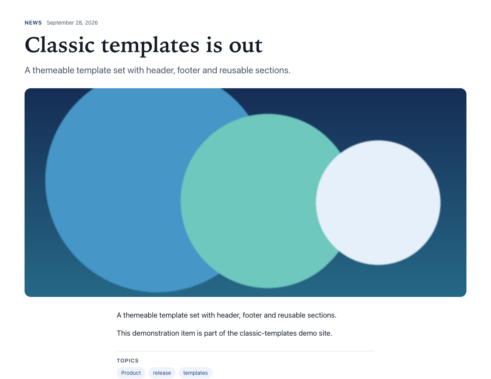
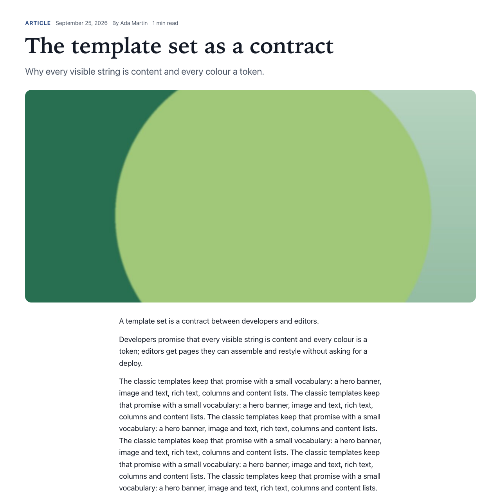

# News items and articles

Types: `ctpl:news` (News item), `ctpl:article` (Article)

## What it is

A **News item** is a dated piece of news with a teaser, a body and an image. An **Article** is the same with the name of its author, for longer texts. Each one has its own page on the site, and appears automatically in [content lists](content-list.md) and, when you pick it, in [card grids](card-grid.md).

## Where you can add it

News items and articles are not dropped on pages. You create them in **jContent**, in the site's content folders:

- News items in **contents > News**.
- Articles in **contents > Articles**.

Each folder only offers its own type. A page then shows them through a [Content list](content-list.md) or a **Card of an existing item** in a [Card grid](card-grid.md). Name that page on the folder (**Listing page**) so the items' breadcrumb goes through it.

## Fields

| Label as shown in the editor | What it does                                                                 | Notes                                                                                                           |
| ---------------------------- | ---------------------------------------------------------------------------- | --------------------------------------------------------------------------------------------------------------- |
| Title                        | Title of the item, shown on cards and as the heading of its page.            | Per language. An item without a title in a language is left out of that language's lists.                       |
| Teaser                       | One or two sentences shown on cards and under the title of the full page.    | Per language. Also used as the page description for search engines when the item has no description of its own. |
| Body                         | The full text, shown on the item's own page.                                 | Per language. Rich text: see [Text](rich-text.md) for what is kept.                                             |
| Publication date             | Date shown to visitors and used to sort lists, newest first.                 | Shared by all languages. Leave empty to show the creation date.                                                 |
| Image                        | Image shown on cards and on the full page.                                   | See [Images](images.md).                                                                                        |
| Text alternative             | What the image means on the full page.                                       | Per language. On cards the image is always decorative.                                                          |
| Decorative image             | Tells screen readers to skip the image.                                      | Default: off.                                                                                                   |
| Author                       | Name of the author as shown to visitors, for example "Jane Smith".           | Articles only. The same in every language.                                                                      |
| Members only                 | Reserves the item for signed-in visitors. See [Members only](#members-only). | Optional section of the edit form. Default once switched on: ticked.                                            |

Tags and categories are not fields of the template set: you set them with Jahia's own **tags** and **categories**, available on every item.

## How it behaves

### The full page

At its own address, an item shows, in this order:

1. A line with its type ("News" or "Article"), its date, and for articles the author ("By Jane Smith") and the reading time ("4 min read").
2. The title, as the page's level 1 heading.
3. The teaser, as a lead paragraph.
4. The image, wide.
5. The body. Its headings start at level 2, under the title.
6. **Topics**: the item's categories and tags, when it has some.

The site header, footer and breadcrumb surround it. The breadcrumb goes through the page that lists the item when its folder names one (**Listing page**, set on the content folder in jContent), for example Home > News > the item's title; otherwise it reads Home > the item's title. The content folder itself is not shown. See [Breadcrumb](breadcrumb.md#the-page-that-lists-a-folder).

### Members only

Switch on the **Members only** section of the item's edit form to reserve it for signed-in visitors. Visitors who are not signed in then get, at the item's address: the type and date line with a **Members only** badge, the title, the teaser, the image, a notice and a [sign-in form](sign-in.md), but not the body. Once signed in, they stay on the page and see the whole item. Cards, compact rows and tiles of the item carry the badge for everybody. The teaser, title, image and date stay public (search results and shared links show them), so write them for that audience. The switch **hides** the body from the page; it does not protect it from being read through the API: see [Members-only content](../guides/members-only-content.md#what-is-protected-and-what-is-only-hidden).

### Cards and compact rows

The same item is also shown:

- as a **card** (in content lists set to Cards, and in card grids): image, type and date line, title linking to the full page, teaser;
- as a **compact row** (in content lists set to Compact list): title as a link, then the type and date line.

On cards the image is always decorative, because the title says what the card is about.

### Dates and reading time

- The date is the **Publication date**, or the creation date when it is empty. It is written in the page's language: "30 September 2026" in English, "30 septembre 2026" in French.
- The reading time is shown for articles only. It counts about 200 words a minute, with a minimum of 1 minute.

### Missing title in a language

An item without a title in the current language is left out of lists and cards in that language. In edit mode its place shows the hint "No title in this language: this item is left out of lists."

### Fixed labels

A few words on these pages are part of the template set, translated for each language of the site, and cannot be edited in jContent: "News", "Article", "By ...", "... min read", "Topics", "Members only" and the sign-in form's words.

### For administrators: search engines

Each full page describes itself to search engines as a news article or an article, with its title, teaser, dates, image, author (or the site's organisation) and tags as keywords. Nothing to set up.

## Good practice

- Write the teaser as a summary that makes visitors want to read on, in one or two sentences. It appears on cards, on the full page and in search results.
- Keep titles short and specific: they are the links of every card and list.
- Always fill in the **Publication date**: lists sort on it.
- Structure long bodies with headings, and describe every image of the body.
- Use categories to group items by topic: [content lists](content-list.md) can filter on them. Tags are shown as topics but lists do not filter on them.
- Give the image a text alternative that fits the full page, or tick **Decorative image** when it only illustrates.

## In other languages

Title, teaser, body and text alternative are per language. The publication date, image and author are shared. Translate every item into each language where it should appear: an untranslated item is left out of that language's lists. Translate category titles too, since they are shown as topics.
