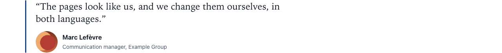

# Quote

Type: `ctpl:quote`

## What it is

A quotation with the name and role of the person quoted and an optional portrait. Use it for a customer testimonial or a statement. The **Large (pull quote)** size shows it in big type, as a highlight between sections.

## Where you can add it

- The page's **main area**.
- Inside a [Columns](columns.md) column, or a [Free zone](free-zone.md).

## Fields

| Label as shown in the editor       | What it does                                                                                       | Notes                                                          |
| ---------------------------------- | -------------------------------------------------------------------------------------------------- | -------------------------------------------------------------- |
| Quotation                          | The words quoted, as plain text.                                                                   | Per language. Do not type quotation marks: the site adds them. |
| Name                               | Name of the person quoted, for example "Jane Smith".                                               | The same in every language.                                    |
| Role                               | Role and organisation, for example "Head of customer care, Acme".                                  | Per language.                                                  |
| Size                               | **Standard** fits in the flow of the page. **Large (pull quote)** shows the quotation in big type. | Default: Standard.                                             |
| Image                              | Portrait of the person.                                                                            | Optional. Always decorative (see below).                       |
| Text alternative, Decorative image | Image fields shared with other components.                                                         | Ignored on quotes.                                             |
| Background                         | Page background, Light band or Accent tint.                                                        | See [Section style](section-style.md).                         |
| Call to action                     | Optional toggle. Adds a button after the quote.                                                    | See [Call to action](call-to-action.md).                       |

A quote has no title field: a quotation is not a heading.

## How it behaves

- **Quotation marks** are added by the site in the style of the page's language: “ ” in English, « » with the proper spaces in French. That is why you type none.
- The name and role appear under the quotation. The **portrait** appears next to them, so it only shows when you fill in a name or a role.
- The portrait is **decorative**: screen readers skip it because the name next to it says who it is.
- **No quotation in the current language:** visitors see nothing. In edit mode the hint "This quote has no text in this language: it is not shown." takes its place.

## Good practice

- Quote real words, and get the person's agreement before publishing them with their name and portrait.
- Keep pull quotes short: one or two sentences. A long text in large type is hard to read.
- Use **Large (pull quote)** sparingly, once per page at most, so it keeps its effect.
- Write the role with the organisation ("Head of customer care, Acme"): it tells visitors why the quote matters.

## In other languages

The quotation and the role are per language; the name and the portrait are shared. Translate the quotation in each language of the site, otherwise the quote disappears from that language's pages.
