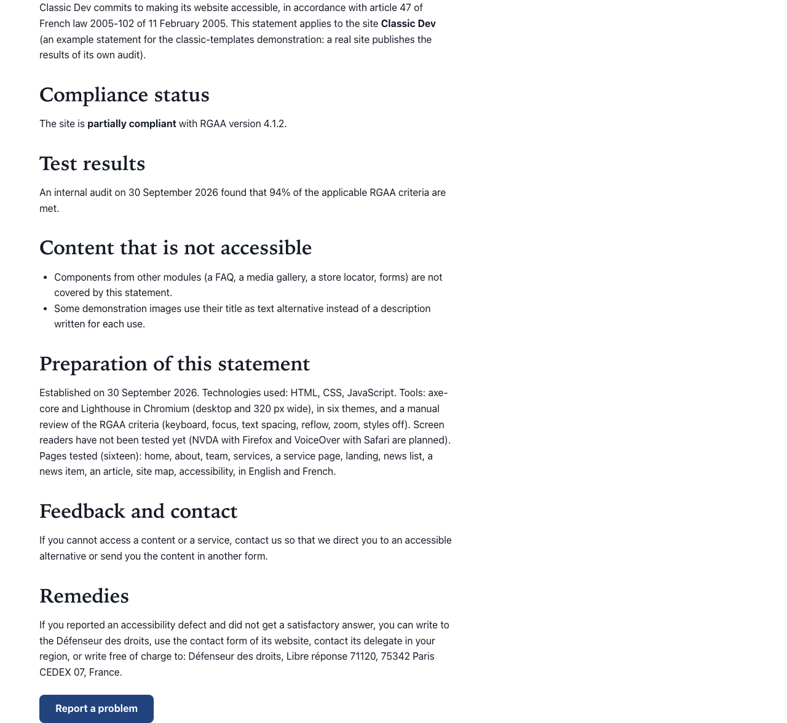

# Text (rich text)

Type: `ctpl:richText`. In the content type picker it is called **Text**.

## What it is

A section of formatted text with an optional title: paragraphs, headings, lists, links, tables, quotes and images, written in Jahia's rich-text editor. It is also the component you use for a call-to-action banner.

## Where you can add it

- The page's **main area**.
- Inside a [Columns](columns.md) column, or a [Free zone](free-zone.md).

## Fields

| Label as shown in the editor | What it does                                                                               | Notes                                                                          |
| ---------------------------- | ------------------------------------------------------------------------------------------ | ------------------------------------------------------------------------------ |
| Title                        | The section heading.                                                                       | Per language. Optional. Level 2 heading (level 3 inside a titled columns row). |
| Text                         | Content of the section.                                                                    | Per language. Rich text.                                                       |
| Text width                   | **Readable** keeps lines short and easy to read. **Wide** uses the full width of the page. | Default: Readable. Use Wide for tables or long lists.                          |
| Background                   | Page background, Light band or Accent tint.                                                | See [Section style](section-style.md).                                         |
| Call to action               | Optional toggle. Adds a button after the text.                                             | See [Call to action](call-to-action.md).                                       |

## How it behaves

### What the site keeps and removes from your text

The site cleans every rich text before showing it, so that all pages look the same, follow the theme and stay safe and accessible. This applies to this section and to every other rich-text field of the template set (the text of [Image and text](image-and-text.md), the body of [news items and articles](news-and-articles.md)).

**Kept:**

- Paragraphs, line breaks, bold, italic, underline, strikethrough, subscript, superscript, highlights.
- Headings, bulleted and numbered lists, definition lists.
- Quotes and citations, abbreviations (with their title), code.
- Links to web addresses (`http`, `https`), email addresses (`mailto`), phone numbers (`tel`), pages of this site, and anchors within the text.
- Images with their text alternative, and figures with a caption.
- Data tables with their caption, header cells and the links between header and data cells.
- The **language of a phrase**: a sentence you mark as written in another language keeps that marking, so screen readers pronounce it correctly.

**Removed:**

- Scripts, style blocks, embedded frames and forms, with their content.
- Colours, fonts and other inline styles, and CSS classes: the site theme owns the look.
- The **target** of a link (a link cannot be forced to open in a new window) and the **title** of links and images.
- Link and image addresses of any other kind (for example `javascript:` or `data:`): the link or image loses its address.

### Headings are renumbered

The page title is the page's only level 1 heading, and the section title is level 2. The headings you write in the text are renumbered to fit under them:

- When the section has a title, the highest heading level you used becomes level 3, the next one level 4, and so on.
- When the section has no title, it becomes level 2.
- A level is never skipped: a level 4 heading written right after a level 2 one becomes the next level down.
- Inside a titled [Columns](columns.md) row, everything moves one more level down.

You can write headings the way the editor offers them. The page outline stays correct either way.

### Images inside the text

An image with no text alternative gets an empty one, so screen readers skip it instead of reading its file name. In edit mode the section then shows the hint "An image in this text has no text alternative: edit the image in the rich-text editor and describe it, or mark it decorative with an empty text."

### Tables scroll on small screens

Every table of a rich text sits in its own scroll area. On a phone, a table wider than the screen scrolls sideways inside the text, while the rest of the page stays in place (no horizontal scrolling of the whole page, even at 320 pixels wide).

- Keyboard users reach the scroll area with the Tab key (it shows the focus ring) and scroll it with the arrow keys.
- Screen readers announce the area by the table's **caption**. A table without a caption is announced as "Table" ("Table 1", "Table 2" when the text has several), and in edit mode the section shows the hint "A table in this text has no caption: add one in the rich-text editor (table properties). It names the table for screen readers."

This applies to every rich-text field of the template set.

### Empty text

A section with no text shows its title (if any) and its button (if switched on). Nothing else.

## Good practice

- Use real headings from the editor's format menu, never bold paragraphs, to structure a long text.
- Use lists for lists, and tables only for data. Give each data table a caption and header cells.
- Write link text that makes sense on its own ("Download the 2026 price list"), not "click here".
- Describe every image in the rich-text editor. If an image is only decoration, give it an empty description on purpose.
- Mark phrases written in another language with the editor's language tool.
- Keep **Readable** width for running text. Long lines are hard to follow.
- Format text with the editor's own tools. Colours, fonts and styles pasted from a word processor are removed anyway.

## In other languages

Title and text are per language. Text width and background are shared. Write or translate the text in each language: a language without text shows only the title and the button.
