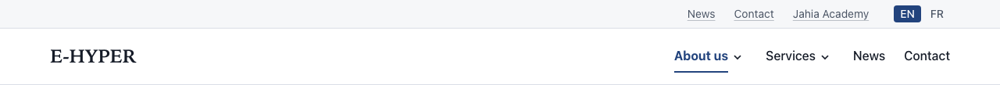
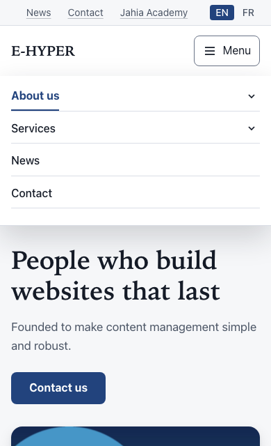

# Site header

Types: `ctpl:siteHeader` (Site header), with its parts `ctpl:linkList` (utility links), `ctpl:languageSwitcher` (Language switcher) and `ctpl:mainNavigation` (Main navigation)

## What it is

The header shared by every page of the site. From top to bottom:

- a thin **utility bar**, aligned to the right, with a few utility links and the **language switcher**;
- the **logo** (or brand name), linking to the home page;
- the **main navigation**, the site menu, built from the pages of the site.

Every site created with this template set gets a header ready to fill in.

## Where you can add it

You do not add the header: it already exists, in the header area of the home page, and appears on every page.

**You edit it from the home page only.** Open the home page in Page Builder and select the header or one of its parts. On every other page the header is locked, so nobody changes it by accident while editing another page.

## Fields

### Site header

| Label as shown in the editor | What it does                                                                 | Notes                                                           |
| ---------------------------- | ---------------------------------------------------------------------------- | --------------------------------------------------------------- |
| Logo                         | Logo shown at the top left, linking to the home page.                        | Optional. An SVG or a PNG about 44 pixels high works best.      |
| Logo for dark mode           | A light-coloured version of the logo, used when the site shows in dark mode. | Optional. Only used when **Logo** is set too.                   |
| Brand name                   | Name shown next to the logo.                                                 | Per language. Leave empty to use the site title.                |
| Show the brand name          | Shows the brand name next to the logo.                                       | Default: on. Untick it when the logo already contains the name. |

### Utility links

A [Link list](links-and-link-lists.md) shown as a row in the utility bar. Its **Title** (for example "Quick links") is not shown on screen: it names the group for screen readers. Add, remove and reorder its links like in any link list.

### Language switcher

It has no fields. It shows a link to the current page in each other language of the site.

### Main navigation

| Label as shown in the editor | What it does                             | Notes                                           |
| ---------------------------- | ---------------------------------------- | ----------------------------------------------- |
| Menu depth                   | How many levels of pages the menu shows. | Default: 3. From 1 (top-level pages only) to 3. |

The menu stores no links of its own. You shape it by creating, ordering, renaming and hiding pages.

## How it behaves

### Logo and brand name

- The logo always links to the home page.
- With the brand name shown, the logo is treated as decoration and screen readers read the brand name. With the brand name hidden, the brand name becomes the logo's text alternative, so the link still has a name.
- Without a logo, the brand name is always shown.
- With a **Logo for dark mode**, visitors who see the site in dark mode (because the site forces it, or because their system is set to dark) get the light-coloured logo.

### Language switcher

- It lists only the languages the current page is translated into, each with its short code on screen ("EN", "FR") and the full language name for screen readers. The current language is marked.
- On a site with one language, or on a page available in only one language, it is hidden.

### Main navigation

- **Level 1** is the pages directly under the home page, in the order of the page tree. **Level 2** and **level 3** are their subpages.
- Besides pages, the menu shows the other items you can create in the page tree: menu labels (text without a link), links to another page or content, and external links. An external link whose address does not start with `http`, `https`, `mailto` or `tel` shows as plain text.
- Menu entries use the page title in the current language.
- Pages that are not published yet appear only in edit mode and preview.
- **Hide from navigation:** in a page's **Page options**, tick **Hide from navigation** to remove it from the menu. The page stays online and reachable by its address, and it still appears in the [site map](site-map.md). Its subpages leave the menu with it.
- Changes to the page tree (a new page, a new title, a new order, a hidden page) show in the menu once published.

On large screens:

- Level 1 entries sit in a row. An entry with subpages has a small arrow button next to it.
- Its panel of level 2 pages opens when the visitor points at the entry or presses the arrow button. Level 3 pages are listed under their level 2 page inside the panel.
- The Escape key closes the panel and returns to its arrow button. A click elsewhere, or moving the focus out of the entry, closes it too.
- The entry of the current page (and its parent entries) is highlighted.

### Mobile menu

On small screens the menu collapses behind a **Menu** button. The menu opens below the header, over the page. Entries with subpages have an arrow button that opens their subpages in place. Escape closes the menu and returns to the Menu button. Moving the focus out of the menu closes it too.

If a visitor's browser does not run JavaScript, the menu still works: on small screens every level is listed, on large screens the panels open on pointer and keyboard focus.

## Good practice

- Keep level 1 short: five to seven entries read well on a laptop. Group the rest under them.
- Give pages short menu-friendly titles. The page title is also the menu entry.
- Use the utility links for a handful of shortcuts (contact, customer area). They are not a second menu.
- Upload a logo about 44 pixels high, and a light version for dark mode if your logo is dark.
- Untick **Show the brand name** only if the name is readable in the logo itself.

## In other languages

- The brand name and the utility link titles and targets are per language. The logos and the menu depth are shared.
- The menu shows each page's title in the visitor's language. A page with no title in that language shows its technical name in the menu: translate every page title.
- The language switcher only offers a language once the current page is translated into it.
