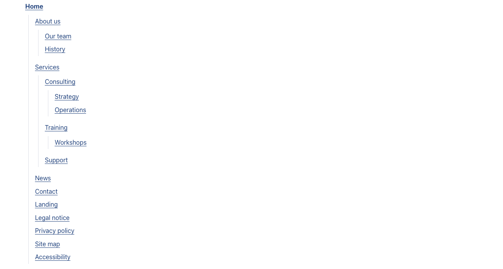

# Site map

Type: `ctpl:siteMap`

## What it is

A section that lists every page of the site as nested lists of links, starting from the home page. It is the visitor site map, a page often called "Site map" and linked from the footer. With the main menu, it gives visitors the second way of finding a page that accessibility rules (RGAA criterion 12.1) ask for.

## Where you can add it

- The page's **main area**, usually on a page of its own.
- Inside a [Columns](columns.md) column, or a [Free zone](free-zone.md).

## Fields

| Label as shown in the editor | What it does                                                | Notes                                    |
| ---------------------------- | ----------------------------------------------------------- | ---------------------------------------- |
| Title                        | The section heading.                                        | Per language. Optional. Level 2 heading. |
| Levels shown                 | How many levels of pages under the home page the map lists. | Default: 5. From 1 to 10.                |
| Background                   | Page background, Light band or Accent tint.                 | See [Section style](section-style.md).   |
| Call to action               | Optional toggle. Adds a button after the map.               | See [Call to action](call-to-action.md). |

## How it behaves

- The map starts with the home page, then lists the pages under it, in the order of the page tree, each level nested under its parent.
- It is built from the page tree, like the main menu. It stores no links: add, rename, reorder or remove a page and the map follows once published.
- **Pages hidden from the navigation are included.** "Hide from navigation" only removes a page from the main menu; the site map is the complete plan of the site (legal notice, accessibility statement and so on).
- Menu labels show as plain text. Links to other content and external links show as links (an external link with an address that does not start with `http`, `https`, `mailto` or `tel` shows as plain text).
- Each entry uses the page title in the current language.

### The site map and Jahia's sitemap module

This component and Jahia's **sitemap** module do different jobs, and you can use both:

- **This site map** is a page for visitors.
- **Jahia's sitemap module** (when your administrator installs it) generates the `sitemap.xml` file that search engines read. It has no page for visitors.

If a page is marked "no index" with Jahia's sitemap module, it is left out of this site map too, so both lists agree.

## Good practice

- Create a page called "Site map" with a site map on it, tick **Hide from navigation** in its **Page options**, and link to it from the footer's legal links (see [Site footer](site-footer.md)).
- Keep **Levels shown** high enough to list every page. Five levels cover most sites.
- Give pages clear titles: the site map is only as readable as they are.

## In other languages

Only the title of the section is per language. The entries show each page's title in the visitor's language: a page with no title in that language shows its title in the site's default language until it is translated.
