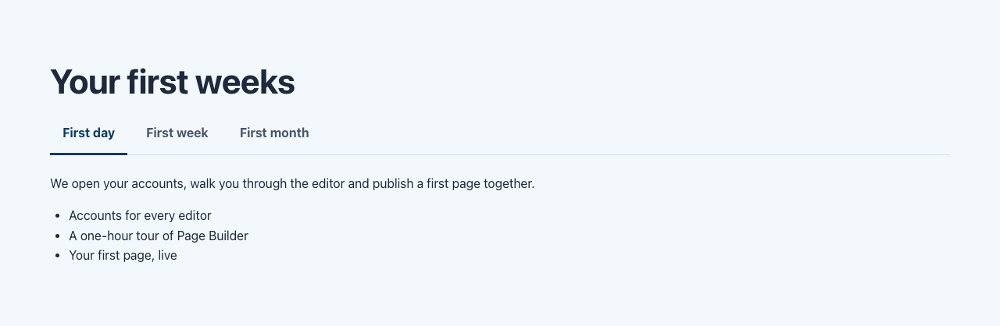

# Tabs

Types: `ctpl:tabs` (Tabs), `ctpl:tab` (Tab)

## What it is

A section of tabs. Each tab has a label and holds its own page sections: a text, an accordion, a card grid, columns, anything you can add to a page. Visitors see one tab at a time and switch with the tab labels.

Use tabs for content that visitors read one part at a time and that shares one subject: the stages of a process, the versions of an offer, the same information for different audiences.

## Where you can add it

- The page's **main area**.
- Inside a [Columns](columns.md) column, or a [Free zone](free-zone.md).

Tabs are added inside the tabs section, and sections inside each tab, the same way as in a [column](columns.md). Reorder tabs, and the sections in a tab, in Page Builder or jContent.

## Fields

### Tabs

| Label as shown in the editor | What it does                                   | Notes                                    |
| ---------------------------- | ---------------------------------------------- | ---------------------------------------- |
| Title                        | The section heading.                           | Per language. Optional. Level 2 heading. |
| Background                   | Page background, Light band or Accent tint.    | See [Section style](section-style.md).   |
| Call to action               | Optional toggle. Adds a button after the tabs. | See [Call to action](call-to-action.md). |

### Tab

| Label as shown in the editor | What it does                | Notes                                        |
| ---------------------------- | --------------------------- | -------------------------------------------- |
| Title                        | The tab label visitors see. | Per language. A tab without it is not shown. |

The sections a tab holds are added inside it, not through a field.

## How it behaves

### For visitors

- The tab labels sit in a row above the content (they wrap onto several lines on a phone). The first tab is selected when the page loads.
- With the keyboard: Tab reaches the selected tab, the Left and Right arrows move to the previous or next tab (from the last back to the first), Home and End go to the first and last tab. The tab is shown as soon as it is reached. Tab again moves into the tab's content.
- Screen readers announce the tabs, their number and which one is selected.

### Without JavaScript

Every tab shows, one after the other, each under its label as a heading. Nothing is hidden, so nothing is lost.

### Links to a tab

Every tab has an anchor built from its name in jContent, for example `#tab-first-month` for a tab named `first-month`. A link to `page.html#tab-first-month` selects that tab. A link to something inside a tab (an [accordion](accordion.md) entry, for example `#acc-translations`) selects the tab holding it, and opens the entry.

### Headings

- Tab labels are headings, one level below the tabs title: level 3 under a titled tabs section, level 2 without a title. When the tabs are shown as tabs, the label stays in the content as a heading for screen readers, but is hidden from the screen (the tab already shows it).
- Sections inside a tab are one level below the tab label: a text section's title is a level 4 heading under a titled tabs section.

### Edit mode

In Page Builder every tab shows, one after the other, each with its label and its sections, so you can select and edit everything. Each tab has its own "add" button for sections, and the tabs section has one to add tabs.

### Empty tabs

A tabs section with no tab (or none with a label in the current language) shows nothing on the live site. It stays in edit mode so you can add tabs.

## Good practice

- Keep labels short (one to three words) and distinct: they are read as a list.
- Use two to six tabs. With more, a page with sections and headings is easier to scan.
- Never hide content in a tab that every visitor must read: most visitors only see the first tab.
- Do not put tabs inside tabs.

## In other languages

The tabs title and every tab label are per language, and so are the sections inside. A tab without a label in a language is left out of that language's page, with everything it holds; edit mode shows "This tab has no label in this language: it is not shown, nor what it holds."
