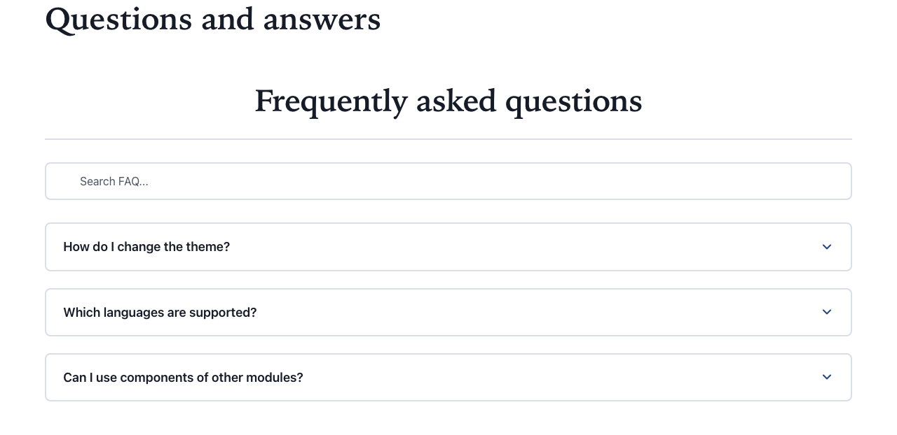
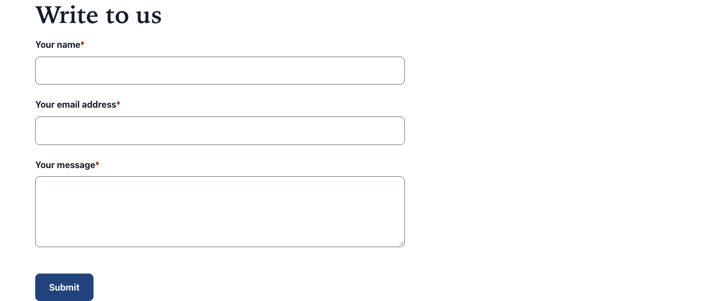

# Add-ons: components of other modules

The template set's page areas only accept its own components. To use a component of another
module (a form, a FAQ, a gallery, a map), put it in a **Free zone** section. The free zone gives it
the section's background, an optional heading, a width, and the site's theme.

See [Free zone](../components/free-zone.md).

## Modules verified with the template set

These modules were tested inside free zones, in light and dark, in English and French:

| Module                                 | What it adds        | Notes                                         |
| -------------------------------------- | ------------------- | --------------------------------------------- |
| **Formidable** (`formidable-elements`) | forms               | placed with a form reference                  |
| **jsfaq**                              | a FAQ               |                                               |
| **js-media-gallery**                   | an image gallery    |                                               |
| **js-store-locator**                   | a store locator map | loads map tiles and a stylesheet from outside |

The free zone accepts components of other modules too, but only these four were checked. Others may
not follow the theme or dark mode.

## Enable a module on your site

A module must be installed on your Jahia and enabled on your site before its components are
offered:

1. Ask your Jahia administrator to install the module on the server if it is not there yet.
2. In your site's administration, open **Modules** and enable the module for the site.
3. Its components are now offered inside free zones.

None of these modules needs jExperience: enabling one adds only that module to the site.

## Place a component in a free zone

1. In Page Builder, add a **Free zone** section to the page's main area.
2. Give it a title if the content needs a heading, and pick its **Width**:
   - **Page width**: aligned with the other sections;
   - **Reading width**: narrower, for text and forms;
   - **Full width**: edge to edge, for maps and galleries.
3. Add the other module's component inside the free zone, and fill it in as that module's
   documentation explains.

## Place a Formidable form

A Formidable form is created once and then placed on pages with a **form reference**:

1. Create the form with Formidable (see Formidable's documentation).
2. On the page, add a **Free zone** section, with **Reading width**.
3. Inside the free zone, add a form reference and pick your form.
4. Publish the page, and the form if it is not published yet.

The template set styles Formidable forms as Formidable intends: visible labels, field borders with
enough contrast, the site's focus ring, and buttons in the theme's colours.

## What the theme bridge does, and its limits

The template set includes a stylesheet that connects the verified modules to the site theme, so
they follow the theme's colours and the light or dark scheme.

- **Formidable**: fields, labels, help texts, messages and buttons follow the theme.
- **jsfaq**: follows the theme's colours. Its focus highlight is replaced by the site's focus ring,
  and its white surfaces are repainted so it reads well in dark mode.
- **js-media-gallery**: takes the theme's text, surfaces, accent and focus colours; video frames and
  overlays keep their own dark backdrop.
- **js-store-locator**: its panel, list, search field, map controls and open or closed labels take
  the theme's colours, in light and dark.

Limits:

- The bridge only covers these four modules. Another module keeps its own look.
- It covers the versions tested. A new version of a module that changes its styles may not follow
  the theme any more.
- Components of other modules are not covered by the template set's accessibility audit. If you use
  them, include them in your own audit and statement. See
  [Accessibility](accessibility.md#add-ons-are-not-covered).

## Store locator and content security policy

The store locator's map loads its tiles from OpenStreetMap (`tile.openstreetmap.org`); its
stylesheet comes with the module. If your site sends a content security policy (CSP), it must allow
the tile server as an image source, or the map shows no background. The store list works either
way. Ask your Jahia administrator.

## Try it on a demo site

`python3 scripts/seed-addons.py` builds a local `classic-addons` site with a FAQ, an image gallery,
a store locator and a contact form, each in a free zone. See
[Demo sites](getting-started.md#demo-sites-for-evaluators).
