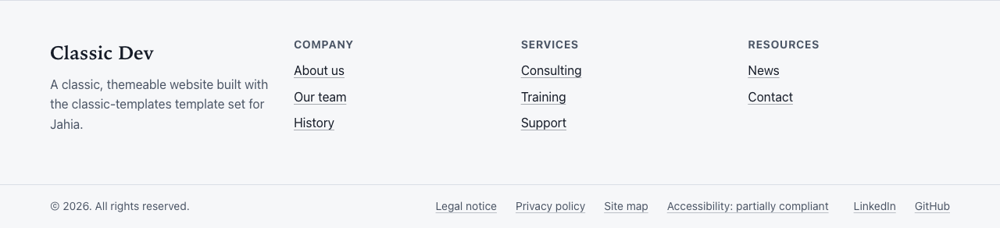

# Getting started

This guide is for site administrators. It covers installing the template set, creating a site, and
the first things to set up before editors start writing pages.

## Requirements

- Jahia 8.2.1 or later.
- The `javascript-modules-engine` module, version 1.2 or a later 1.x version.
- Recommended: Jahia's `sitemap` module, to generate `sitemap.xml` for search engines. See
  [Search engines](seo.md#sitemapxml-for-search-engines).

The template set has no Java part and no server configuration. Everything you set up afterwards is
content or site settings.

## Install the module

Classic templates is a Jahia module like any other. Its package is a `.tgz` file (for example
`classic-templates-0.1.0.tgz`). Install it the way you install your other modules, for example from
Jahia's module administration or with the provisioning API.

Once it is installed and started, **classic-templates** appears in the list of template sets when
you create a site.

## Create a site

1. In Jahia's administration, create a new site.
2. Pick the **classic-templates** template set.
3. Add the languages English and French. You can add other languages: every text a visitor reads is
   content you can translate. The few texts that come with the template set itself (for example
   "Skip to main content" or the "Menu" button) exist in English and French only.
4. Give the site a title and a description. The title is shown in the footer, in the browser tab of
   every page, and next to the logo until you set a brand name. The description is used as the
   search engine description of any page that has none of its own.

## What a new site contains

Every new site starts with:

- **A home page** on the Home template, titled "Home" (English) and "Accueil" (French). Its
  "Hide the page title" option is already ticked, because a home page usually opens with a banner.
  Its hero area and main area are empty.
- **The site header**, stored under the home page. It holds the "Quick links" link list (empty),
  the language switcher and the main navigation, set to three levels.
- **The site footer**, stored under the home page. It holds a copyright line
  ("© {year}. All rights reserved." in English, "© {year}. Tous droits réservés." in French),
  empty footer columns, an empty "Legal information" link list and an empty "Follow us" link list.
- **Two content folders** in jContent: `contents/news` ("News"), which only accepts news items, and
  `contents/articles` ("Articles"), which only accepts articles. Once a page lists them, name it
  on each folder (**Listing page**) so the breadcrumb of their items goes through it.

Empty link lists show nothing on the live site, so a new site shows a header with the site title
and the language switcher, and a footer with the site title and the copyright.

## First steps

Do these in order. Each step links to the guide that explains it in detail.

### 1. Brand name and logo

The header is shared by every page and edited **on the home page only**
([why](editing-content.md#the-shared-header-and-footer)).

1. Upload your logo to the media library. An SVG, or a PNG about 44 pixels high, works best. If
   you want a separate logo for dark mode, upload a light-coloured version too.
2. Open the home page in Page Builder and select the site header.
3. Fill in **Logo** and, if you have one, **Logo for dark mode**.
4. Fill in **Brand name**, or leave it empty to use the site title.
5. Untick **Show the brand name** if your logo already contains the name. The name is then used as
   the logo's text alternative.
6. In the same header, add links to the "Quick links" list if you need a utility bar above the
   menu (for example "Contact" or "Jobs").

See [Site header](../components/site-header.md).

### 2. Footer

Still on the home page, select the site footer:

- **Tagline**: one or two sentences under the site name.
- **Copyright**: `{year}` is replaced with the current year, so you never have to update it.
- **Footer columns**: add one link list per column, each with a title.
- **Legal information**: links to the legal notice, the privacy policy, the site map and the
  accessibility statement. See [Accessibility](accessibility.md#the-accessibility-statement).
- **Follow us**: links to your social media pages.

See [Site footer](../components/site-footer.md) and
[Links and link lists](../components/links-and-link-lists.md).

### 3. Pages and menu

Create your pages under the home page. The main menu is built from them automatically: there is
no menu to maintain separately. See [Pages and templates](pages-and-templates.md).

### 4. Theme

Pick a theme and a light or dark colour scheme in the site settings. See
[Themes and appearance](themes-and-appearance.md).

### 5. Publish

Publish the site in every language, and publish the images in the media library as well:
publishing a page does not publish the images it uses. See
[Publishing](editing-content.md#publishing).

## Demo sites for evaluators

The quickest way to see a complete site is the **pre-packaged demo site**: install the
`classic-templates-prepackaged-website` module (same version as the template set) next to the
template set, then in Jahia's administration open **Projects** and, under **Import prepackaged
project**, choose **Classic Templates demo site (classic-dev) - pre-packaged**. You get the
`classic-dev` site in English and French, published: 19 pages using every section of the template
set, news items and articles. It needs no other module. See the
[pre-packaged site README](../../packages/prepackaged-site/README.md).

Two scripts in the repository's `scripts/` folder build demonstration sites on a local Jahia. They are
meant for evaluating the template set, not for production sites. They need Python 3 and the
Pillow library (they generate the demo images), and they read `JAHIA_URL` and `JAHIA_USER` from the
environment (defaults: `http://localhost:8080` and `root:root1234`).

- `python3 scripts/seed-demo.py --recreate` builds the `classic-dev` site: a three-level page tree
  in English and French, header and footer links, images, every section type, news items and
  articles with content lists, a site map page and an example accessibility statement, all
  published. `--recreate` **deletes the site first** if it exists. `--sections-only` only adds the
  example sections to an existing site and never changes existing content.
- `python3 scripts/seed-addons.py` builds the `classic-addons` site, with components of other
  modules placed in free zones: a FAQ, an image gallery, a store locator and a contact form. The
  modules `jsfaq`, `js-media-gallery`, `js-store-locator` and `formidable-elements` must be
  installed on the instance. It is a separate site on purpose: see [Add-ons](add-ons.md).
