# Classic Templates: the template set

The **classic-templates** template set (`org.jahia.modules.javascript:classic-templates`), one of
the three packages of this repository. Back to the [repository README](../../README.md).

A themeable Jahia JavaScript template set with the standard building blocks of a corporate or
institutional website: a header with logo, three-level menu, utility links and language switcher,
a footer, a breadcrumb trail, and a library of reusable sections, plus news and articles with their
own pages.

Everything a visitor reads is contributed content, editable in Page Builder and jContent, in every
language of the site. The look comes entirely from CSS design tokens: a site switches theme, or
light and dark, from its settings, with no code change.

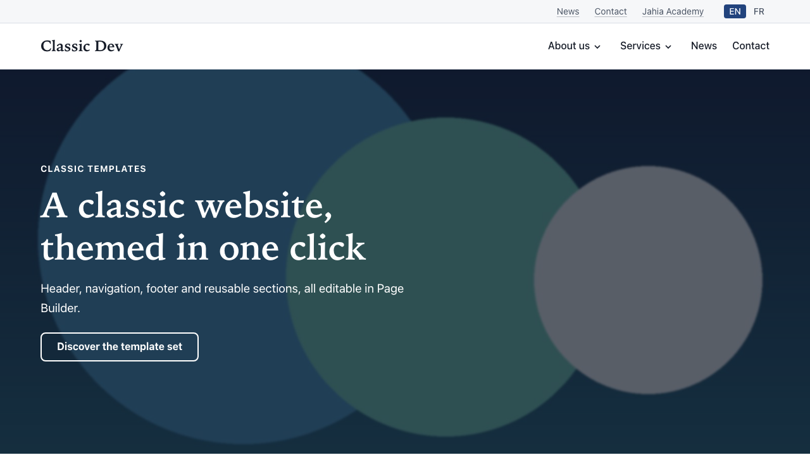

## Highlights

- **Complete site chrome.** A header with a logo (with an optional dark-mode variant), a brand
  name, a menu built from the page tree three levels deep, utility links, a language switcher and an
  optional sign-in / sign-out entry (one switch, no link to maintain).
  A footer with a tagline, link columns, legal and social links and a copyright line. A breadcrumb
  trail. Header and footer are shared by every page and edited on the home page.
- **Reusable sections.** Hero banner, image and text, rich text, columns, card grid (cards, icon
  tiles or logos), accordion, tabs, key figures, quote, link list, content list, site map and free
  zone. Every section can end with an optional call to action. Tables in rich text scroll on
  small screens.
- **News and articles.** Stored in content folders, each with its own page, listed as cards or
  compact rows by content lists that filter by folder, category and language.
- **Themes.** Seven themes (Classic, Ocean, Terracotta, Horizon, Sage, Slate, Graphite), each in light and dark, chosen per site.
  Visitors get their system's scheme unless the site forces one. Contrast is checked for every
  theme and scheme.
- **Accessible by default.** WCAG 2.1 AA and RGAA 4.1.2 audited. Skip link, landmarks, strict
  heading order, keyboard menu, visible focus, reflow at 320 px, language-aware links, a site map as
  the second navigation system. Rich text is cleaned and restructured when it is rendered.
- **Search-engine and share ready.** One `<h1>` per page, titles and descriptions, image
  alternatives, Open Graph and Twitter card tags with an image on every page, and
  schema.org structured data (JSON-LD) on every page: WebSite, Organization, WebPage, the
  breadcrumb, and NewsArticle or Article on news and articles.
- **Open to other modules.** A free zone section takes components of other modules (Formidable
  forms, a FAQ, a media gallery, a store locator), and a token bridge makes them follow the
  site's theme.
- **Bilingual out of the box.** Every editor label, tooltip and visitor-facing string is
  available in English and French.

## Components

| Component         | What it is for                                                               | Docs                                                                  |
| ----------------- | ---------------------------------------------------------------------------- | --------------------------------------------------------------------- |
| Site header       | Logo, brand name, main menu, utility links, language switcher, sign-in entry | [site-header](../../docs/components/site-header.md)                   |
| Site footer       | Tagline, link columns, legal and social links, copyright                     | [site-footer](../../docs/components/site-footer.md)                   |
| Breadcrumb        | The trail from home to the current page, above the content                   | [breadcrumb](../../docs/components/breadcrumb.md)                     |
| Hero banner       | The banner at the top of a page: photo, split or plain                       | [hero-banner](../../docs/components/hero-banner.md)                   |
| Hero carousel     | Hero banners shown one at a time, autoplay off by default                    | [hero-carousel](../../docs/components/hero-carousel.md)               |
| Image and text    | An image beside a heading, rich text and a button                            | [image-and-text](../../docs/components/image-and-text.md)             |
| Rich text         | A heading and formatted text, at reading width or wide                       | [rich-text](../../docs/components/rich-text.md)                       |
| Columns           | Two, three or four columns of sections                                       | [columns](../../docs/components/columns.md)                           |
| Card grid         | Hand-picked cards, icon tiles or a logo strip                                | [card-grid](../../docs/components/card-grid.md)                       |
| Accordion         | Entries that open and close, such as questions and answers                   | [accordion](../../docs/components/accordion.md)                       |
| Key figures       | A row of figures with their labels                                           | [key-figures](../../docs/components/key-figures.md)                   |
| Quote             | A quotation with the person's name, role and portrait                        | [quote](../../docs/components/quote.md)                               |
| Link list         | A list of links: a section, a bar or a footer column                         | [links-and-link-lists](../../docs/components/links-and-link-lists.md) |
| Content list      | News or articles found automatically, sorted and filtered                    | [content-list](../../docs/components/content-list.md)                 |
| Notice bar        | A slim band of the latest items as dated links, dismissible                  | [notice-bar](../../docs/components/notice-bar.md)                     |
| News and articles | Editorial items with their own page, card and compact views                  | [news-and-articles](../../docs/components/news-and-articles.md)       |
| Site map          | Every page of the site as nested lists                                       | [site-map](../../docs/components/site-map.md)                         |
| Tabs              | Tabs, each holding its own sections                                          | [tabs](../../docs/components/tabs.md)                                 |
| Free zone         | A section for components of other modules                                    | [free-zone](../../docs/components/free-zone.md)                       |
| Call to action    | The optional button any section can end with                                 | [call-to-action](../../docs/components/call-to-action.md)             |

Shared settings used across components: [section backgrounds](../../docs/components/section-style.md)
and [images and their alternatives](../../docs/components/images.md).

## Documentation

The full documentation for editors and site administrators is in [`docs/`](../../docs/README.md):

- **Guides:** [getting started](../../docs/guides/getting-started.md),
  [pages and templates](../../docs/guides/pages-and-templates.md),
  [editing content](../../docs/guides/editing-content.md),
  [themes and appearance](../../docs/guides/themes-and-appearance.md),
  [accessibility](../../docs/guides/accessibility.md), [search engines](../../docs/guides/seo.md),
  [add-on modules](../../docs/guides/add-ons.md), [questions and answers](../../docs/guides/faq.md).
- **Component reference:** [all components](../../docs/components/index.md).

## Themes

The theme and colour scheme are site settings: edit the site in jContent and, under "Site look",
choose a "Theme" and "Light or dark". "Automatic" follows each visitor's system setting.

|                                 | Light                                                              | Dark                                                             |
| ------------------------------- | ------------------------------------------------------------------ | ---------------------------------------------------------------- |
| Classic (navy)                  | 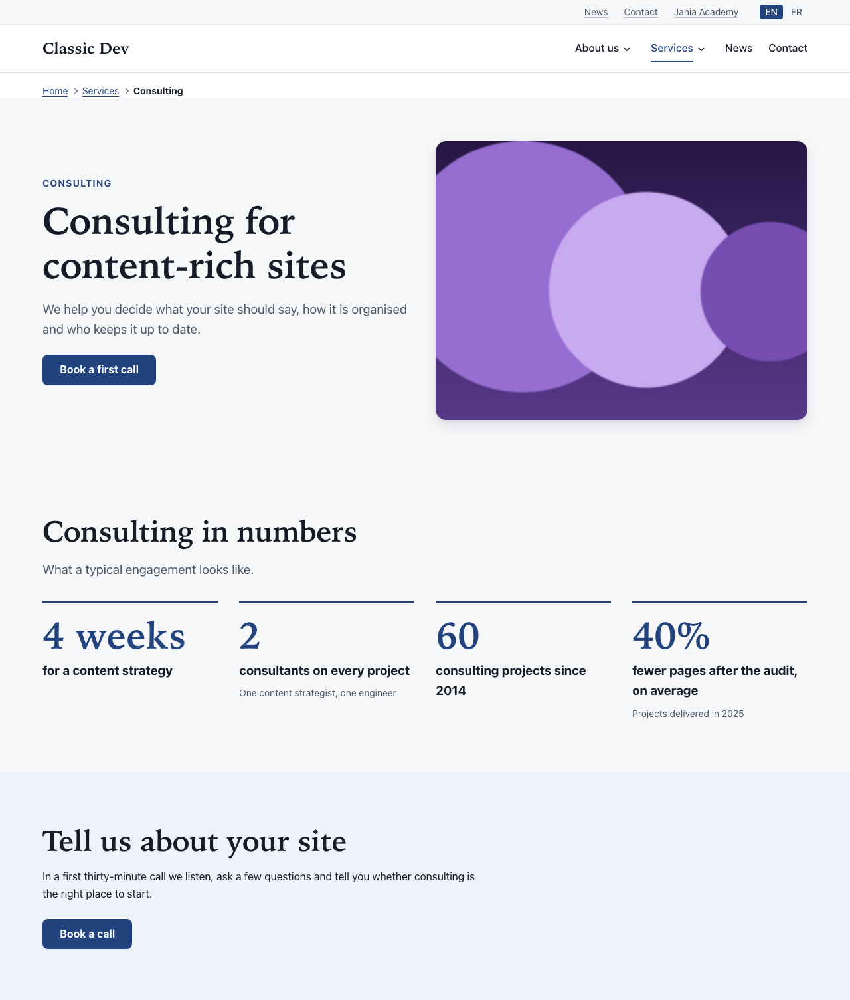       |        |
| Ocean (teal)                    | 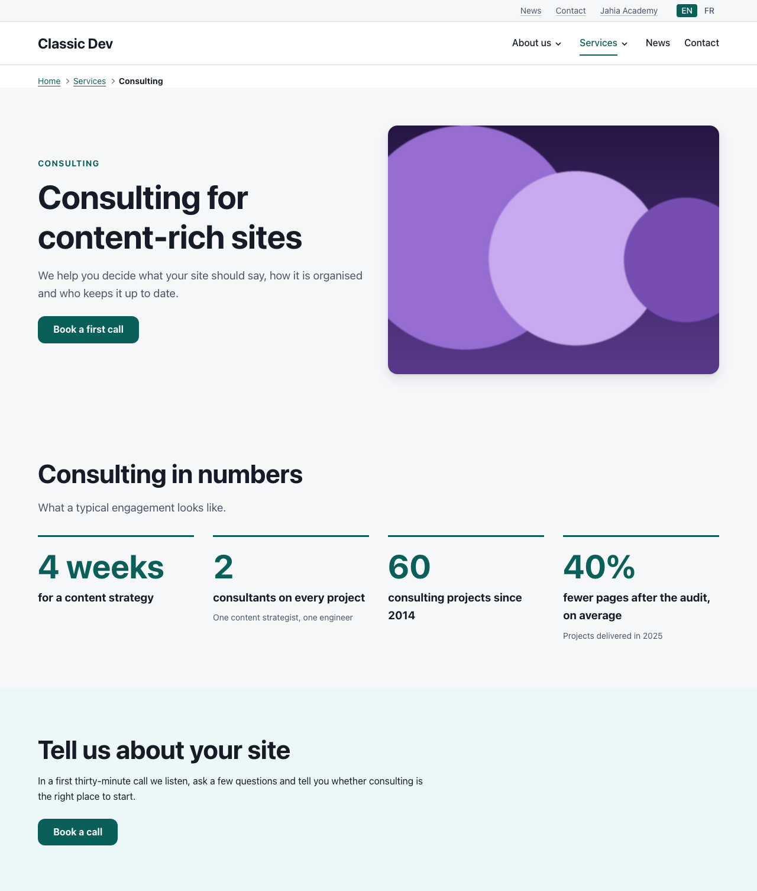           | 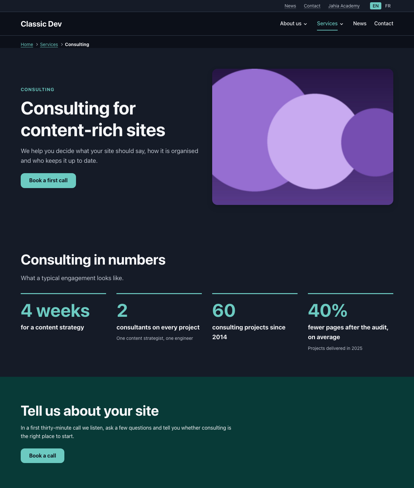           |
| Terracotta (warm)               |  | 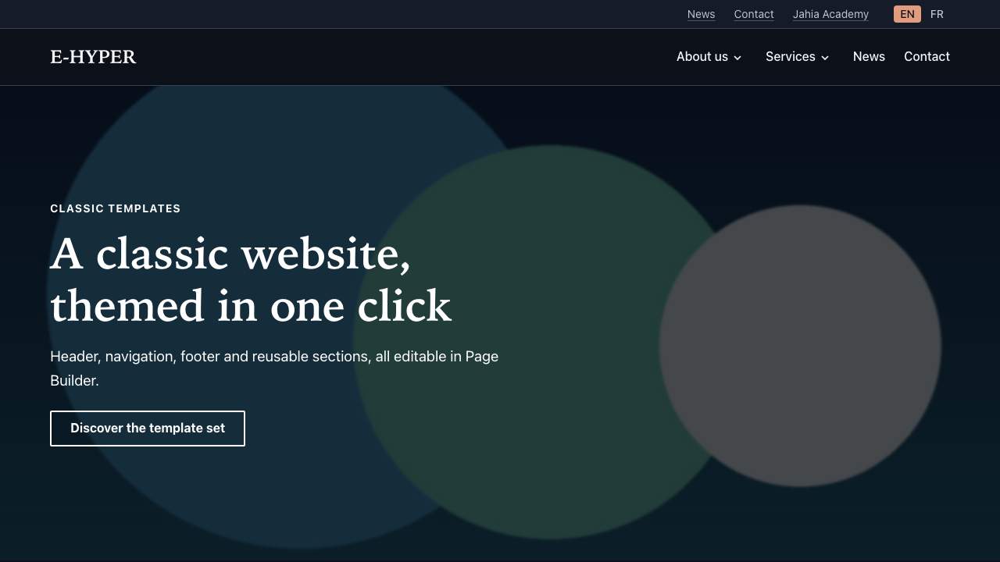 |
| Horizon (navy and orange)       |        | 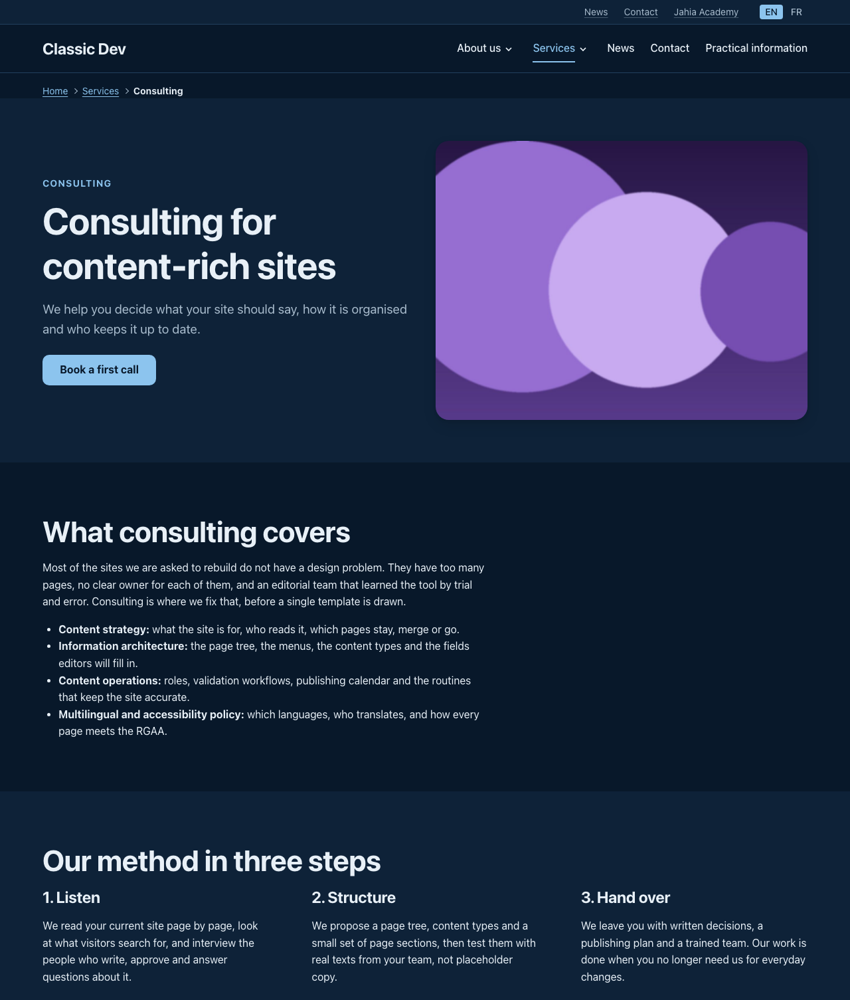       |
| Sage (green and coral)          | 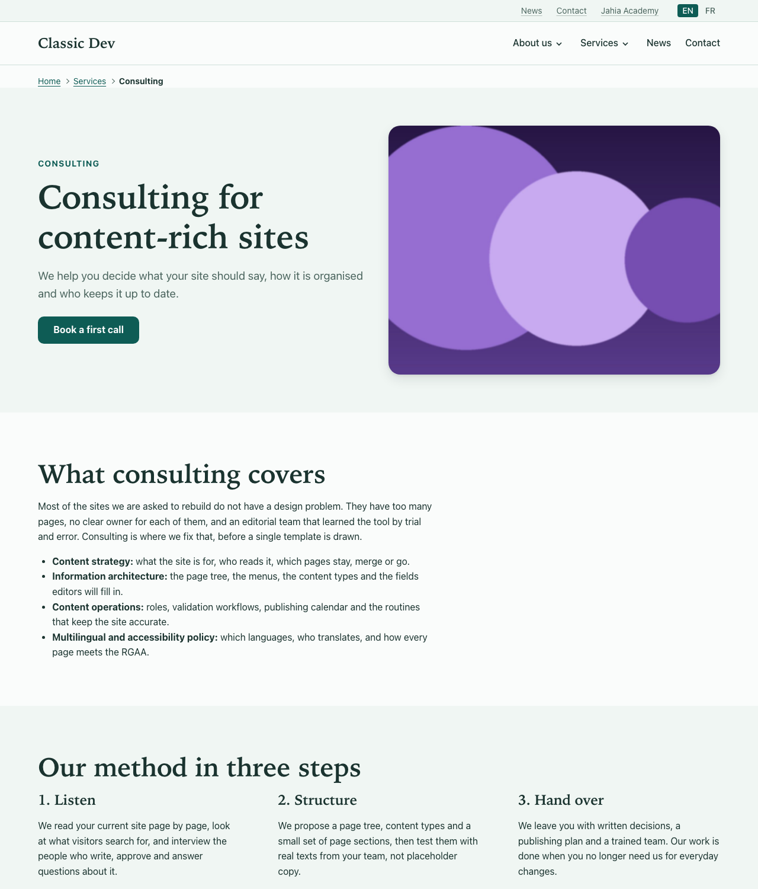             | 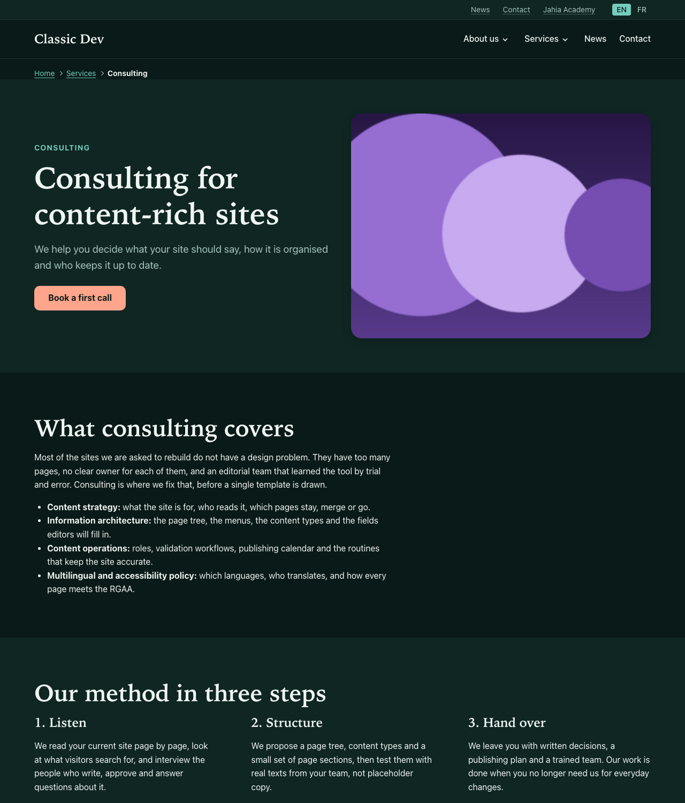             |
| Slate (ink and green)           | 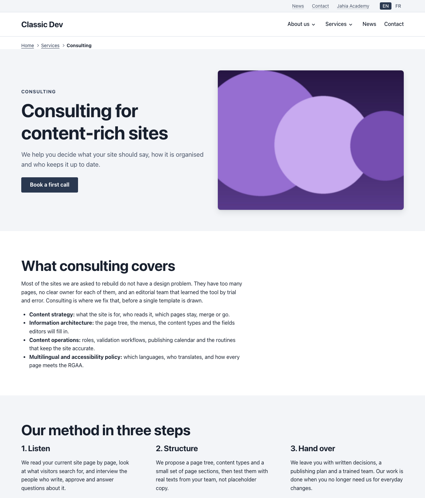           | 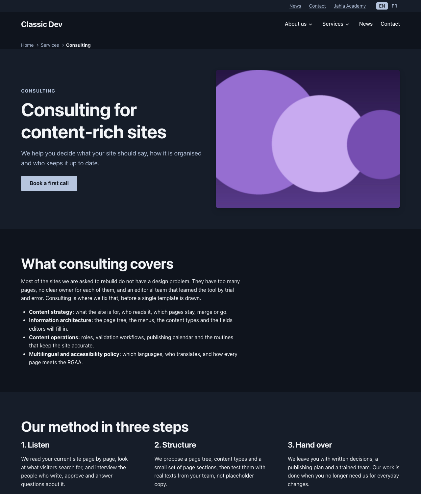           |
| Graphite (charcoal and crimson) | 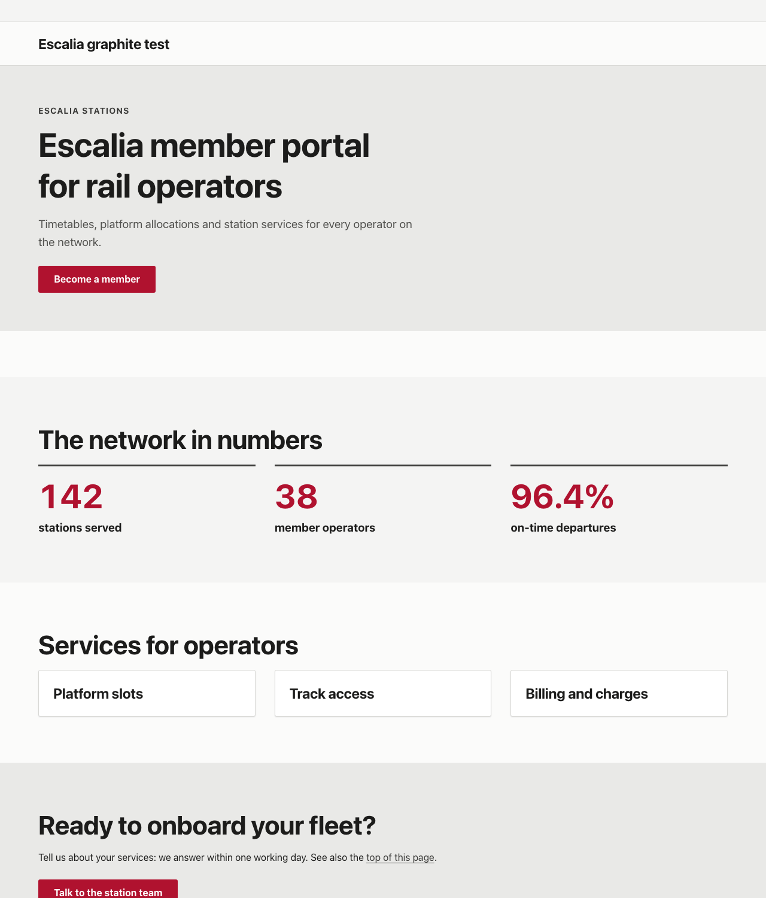     | 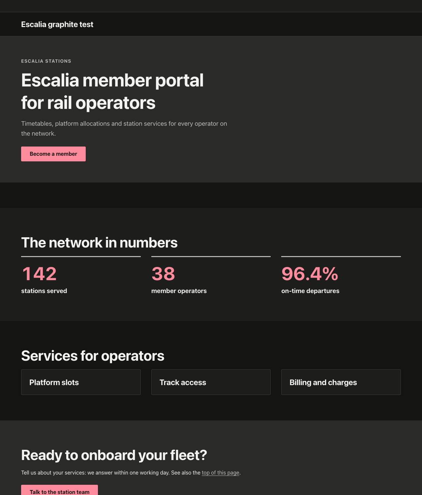     |

Components never contain a colour, font or shadow value. They read semantic CSS custom properties
(`--ctpl-color-text`, `--ctpl-color-accent`, `--ctpl-color-action` for buttons, `--ctpl-color-highlight`, ...) defined in `src/templates/tokens.css`, in three
tiers: primitives, semantic roles in `light-dark()` pairs, and a few component settings. A theme is
a set of overrides of the semantic tokens under `[data-ctpl-theme="<name>"]`. Adding one means
adding its tokens, its value to the site-settings choice list (with EN and FR labels), and running
`yarn check:contrast`.

## Accessibility and search engines

- Audited against WCAG 2.1 AA (axe-core, the full rule set, on every page, in every theme and
  scheme) and against RGAA 4.1.2 by a manual review. The review covers keyboard use, focus
  visibility over images, reflow at 320 px, text spacing, styles off, language changes,
  navigation systems and the heading outline. Screen readers have not been tested yet.
- Editors keep control of what only they can decide: alternative texts (per use, or "decorative"),
  headings and link labels. Edit mode shows a hint when something is missing.
- In France, the accessibility statement and the "Accessibilité : ... conforme" mention are site
  content. The demo site shows how: a statement page linked from the footer legal links.
- Structured data is generated from the content itself; there is nothing to fill in beyond good
  titles, teasers, dates, authors and tags. Use Jahia's `sitemap` module for `sitemap.xml`; the
  site map component is the page visitors read.

See the [accessibility](../../docs/guides/accessibility.md) and [search engines](../../docs/guides/seo.md) guides.

## Add-on modules

Drop them in a **Free zone** section. The template set does not depend on them. The site must
enable each module, and `src/templates/addons.css` maps their styles onto the theme.

| Module                             | Verified                                                                                                               | Notes                                                                                                                          |
| ---------------------------------- | ---------------------------------------------------------------------------------------------------------------------- | ------------------------------------------------------------------------------------------------------------------------------ |
| Formidable (`formidable-elements`) | Forms placed with a Form reference                                                                                     | Fields, labels and messages styled by the template set                                                                         |
| `jsfaq`                            | FAQ with search, tag filter and expand / collapse                                                                      | Heading level chosen per FAQ; schema.org FAQPage                                                                               |
| `js-media-gallery`                 | Image galleries (picked or from a folder: carousel, masonry, grid), video gallery, featured and list views, video hero | Internal videos take captions and a transcript; YouTube and Vimeo play in frames the site's content security policy must allow |
| `js-store-locator`                 | Store search, list, map and store pages                                                                                | Follows the theme in light and dark; the map loads OpenStreetMap tiles                                                         |

None of them needs jExperience: enabling them on a site adds only the module itself. Use
[jsfaq 1.1.0](https://github.com/smonier/jsfaq/releases/tag/v1.1.0),
[js-media-gallery 1.1.0](https://github.com/smonier/js-media-gallery/releases/tag/1.1.0) and
[js-store-locator 1.1.0](https://github.com/smonier/js-store-locator/releases/tag/v1.1.0) or later:
these versions were reviewed and audited against RGAA 4.1.2 on the `classic-addons` demo site and
the Practical information page of `classic-dev`, in English and French, light and dark.

See the [add-ons guide](../../docs/guides/add-ons.md).

## Requirements

- Jahia 8.2.1.0 or later with `javascript-modules-engine` 1.2 or later.
- To build: Node.js 22 and Yarn 4 (pinned in the repository's `.yarn/releases`; enable it with `corepack enable`).
  For the Maven build: Java 17 and Maven 3.9.
- Recommended on sites: Jahia's `sitemap` module.

## Install

Download `classic-templates-<version>.tgz` from the
[GitHub releases](https://github.com/Jahia/classic-templates/releases) and install it in Jahia
(Administration > Modules, or the provisioning API). Then create a site on the
**classic-templates** template set, with English and French: the new site already has a home page
with its header and footer. For a populated site, import the
[pre-packaged demo site](../prepackaged-site/README.md), or build one with the scripts listed in
the [repository README](../../README.md#demo-sites).

## Development

Run the commands below from this folder (`packages/template-set`), a standalone Yarn project.
`yarn deploy` reads `JAHIA_HOST` and `JAHIA_USER` from `.env` (copy `.env.example`; defaults:
`http://localhost:8080`, `root:root1234`).

| Command                         | Description                                                                                                    |
| ------------------------------- | -------------------------------------------------------------------------------------------------------------- |
| `yarn install`                  | Install the dependencies                                                                                       |
| `yarn build`                    | Type-check, build with Vite, pack `dist/package.tgz`                                                           |
| `yarn deploy`                   | Install `dist/package.tgz` on the Jahia instance                                                               |
| `yarn dev`                      | Watch mode: rebuild and redeploy on every change (for developers, in a terminal)                               |
| `yarn lint` / `yarn format`     | ESLint / Prettier                                                                                              |
| `yarn test:unit`                | Unit tests of the pure helpers (Vitest): URL checks, rich-text sanitizer, list queries, structured data, dates |
| `yarn check:tokens`             | Fails on any literal colour or primitive token outside `src/templates/tokens.css`                              |
| `yarn check:contrast`           | Checks WCAG AA contrast of every theme in light and dark                                                       |
| `python3 scripts/make-icons.py` | Redraws the content-type icons (Pillow)                                                                        |

`mvn clean install` at the repository root builds the same package through Maven, as the CI runs it
(`target/classic-templates-<version>.tgz`).

### Package layout

```
src/
  components/<Category>/<Name>/   one folder per content type: definition.cnd, types.ts, views, CSS module
  lib/                            shared helpers: links, images, headings, rich-text sanitizer, queries, structured data
  templates/                      Layout, page templates, main-resource template, breadcrumb, tokens, add-on bridge
settings/
  definitions.cnd                 namespaces (ctpl, ctplmix), base and shared mixins
  import.xml                      pages and folders seeded when a site is created
  locales/                        visitor-facing strings (en.json, fr.json)
  resources/                      editor labels and tooltips (.properties, EN and FR)
  content-editor-forms/           Content Editor form overrides
  content-types-icons/            one icon per content type
static/js/                        the menu's progressive enhancement (no framework)
scripts/                          icon drawing, token and contrast gates
pom.xml                           Maven wrapper around the Vite build
```

The documentation for editors (`docs/`), the demo seeding scripts (`scripts/`), the Cypress tests
(`tests/`), the quality gates and the contributing rules are shared by the repository: see the
[repository README](../../README.md).

## License

[MIT](../../LICENSE), copyright Jahia.
